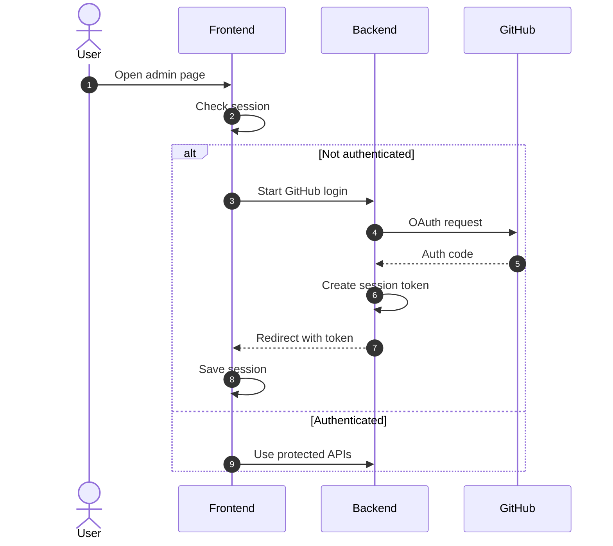

# CIROH Hub - GitHub Login / Admin Auth Flow

> \[DEPRECATED\] The GitHub OAuth login + server-side issue creation flow has been removed from this site.
>
> Use these GitHub issue templates instead:
> - Software: https://github.com/CIROH-UA/ciroh-ua_website/issues/new?template=product-request.md
> - Blog: https://github.com/CIROH-UA/ciroh-ua_website/issues/new?template=docuhub-blog-post.md

This document explains how DocuHub’s GitHub login works end-to-end: how users are redirected to GitHub OAuth, how the backend exchanges the OAuth code for a GitHub token, how the system issues an application JWT, how the frontend stores that JWT, and how admin pages use it to call protected APIs.

> Summary: DocuHub uses GitHub OAuth to obtain a GitHub access token, then wraps it in a DocuHub-issued JWT (stored client-side) and uses that JWT for subsequent API calls via `Authorization: Bearer <JWT>`.

---

## Architecture overview

**Frontend (Docusaurus site)**
- Runs at `http://localhost:3000` in dev, or `https://docs.ciroh.org` in prod.
- Admin pages are static React routes under `/admin/*`.
- Stores the DocuHub JWT in `localStorage`.

**Backend (AWS Lambda behind API Gateway)**
- Source: `AWS Lambda Server side code/ciroh-github-auth-lambda/index.js`
- Exposes endpoints under `/api/*` (via API Gateway).
- Handles OAuth redirect + callback.
- Calls GitHub REST APIs using the GitHub token.
- Issues a **DocuHub JWT** to the browser, then redirects back to the frontend.

**GitHub**
- OAuth Authorization endpoint: `https://github.com/login/oauth/authorize`
- OAuth token exchange endpoint: `https://github.com/login/oauth/access_token`
- API endpoints used (examples): `GET /user`, `POST /repos/{owner}/{repo}/issues`.

---

## High-level sequence

---

## Frontend behavior (Docusaurus)

### Where auth is stored

- JWT is stored in browser localStorage under:
  - `ciroh_admin_jwt`
- “Return-to” navigation is stored in sessionStorage under:
  - `ciroh_admin_returnTo`

Implementation: `src/utils/authToken.js`

- `getStoredJwt()` reads `ciroh_admin_jwt`.
- `setStoredJwt(token)` writes it.
- `clearStoredJwt()` removes it.
- `consumeJwtFromUrl()` looks for `?token=...` in the current URL, stores it, and removes it from the address bar.
- `setLoginReturnTo(path)` stores a desired post-login URL in sessionStorage.
- `consumeLoginReturnTo()` reads and clears it.

### How admin pages enforce login

Admin pages follow the same pattern:
1. Call `consumeJwtFromUrl()` once on mount (so OAuth redirects can deliver the JWT).
2. Check `getStoredJwt()`.
3. If missing (or if API returns `401`), redirect the browser to `buildApiUrl(apiBaseUrl, 'github-login')`.

Examples:
- `src/pages/admin/index.jsx`
- `src/pages/admin/add-product.jsx` (used by `/admin/add-software` wrapper)

### Why “return-to” is needed

The OAuth callback in the Lambda redirects to `/admin?token=<JWT>` (the admin landing page).

If the user originally intended to go to `/admin/add-software`, we store that intent before login:
- When redirecting to `/api/github-login`, we call:
  - `setLoginReturnTo(window.location.pathname + window.location.search + window.location.hash)`

Then after successful login, `/admin` consumes that value and navigates the user to the original target.

---

## Backend behavior (AWS Lambda)

Source: `AWS Lambda Server side code/ciroh-github-auth-lambda/index.js`

### Endpoint: `GET /api/github-login`

Purpose:
- Start the OAuth flow.

Behavior:
- Builds `redirect_uri` to the Lambda’s callback endpoint: `${API_BASE_URL}/api/github-callback`.
- Redirects the browser to GitHub OAuth:
  - `https://github.com/login/oauth/authorize?client_id=...&scope=...&redirect_uri=...&prompt=consent`

### Endpoint: `GET /api/github-callback`

Purpose:
- Handle the GitHub redirect back to us.

Behavior:
1. Reads `code` from query string.
2. Exchanges `code` for a GitHub `access_token`.
3. Validates token by calling `GET https://api.github.com/user`.
4. Creates a **DocuHub JWT** containing:
   - `githubToken` (the GitHub token)
   - `login` (GitHub username)
5. Redirects browser back to the frontend with the DocuHub token:
   - `${FRONTEND_URL}${FRONTEND_BASE_PATH}/admin?token=<JWT>`

### Endpoint: `GET /api/me`

Purpose:
- Validate the DocuHub JWT from the frontend.

Behavior:
- Verifies the JWT signature using `JWT_SECRET`.
- Uses the embedded GitHub token to call `GET /user` and returns basic profile information.
- Returns `401` if the JWT is missing/invalid.

### Protected write endpoints (example: create issue)

Example endpoint:
- `POST /api/create-product-issue`

Behavior:
- Verifies DocuHub JWT.
- Calls GitHub API with the embedded GitHub token.
- Returns success details (issue URL/number).

---

## How frontend calls the backend

Implementation: `src/utils/apiClient.js`

- `buildApiUrl(apiBaseUrl, endpoint)` constructs URLs like:
  - `${apiBaseUrl}/api/<endpoint>`

- `apiFetch(apiBaseUrl, endpoint, { token, ... })` sets:
  - `Authorization: Bearer <JWT>` when `token` is provided.

Notes:
- This flow is intentionally “CORS-friendly”: it does not rely on cookies.
- Credentials are omitted (`credentials: 'omit'`).

---

## Environment variables

### Frontend (Docusaurus)

`docusaurus.config.js` uses `dotenv` and reads environment variables at startup.

The frontend primarily needs:
- `REACT_APP_API_BASE_URL` or `VITE_API_BASE_URL` (fallback exists)
  - Used to construct `/api/github-login`, `/api/me`, etc.

### Lambda (GitHub Auth)

From `AWS Lambda Server side code/ciroh-github-auth-lambda/README.md`:

Required:
- `API_BASE_URL` (API Gateway base URL, no trailing slash)
- `FRONTEND_URL` (frontend origin you expect users to browse)
- `JWT_SECRET`
- `GITHUB_CLIENT_ID`
- `GITHUB_CLIENT_SECRET`
- `GITHUB_REPO` (e.g., `CIROH-UA/ciroh-ua_website`)

Optional:
- `FRONTEND_BASE_PATH` (if hosted under a subpath)
- `FRONTEND_URLS` (extra allowed origins for CORS)
- `GITHUB_OAUTH_SCOPE` (default `public_repo`)
- `JWT_EXPIRES_IN` (default `7d`)

---

## Local dev checklist

1. Start frontend:
   - `npm start`

2. Ensure frontend knows your API base URL:
   - Set `REACT_APP_API_BASE_URL` (or `VITE_API_BASE_URL`) in `.env`.
   - Restart `npm start` after changing `.env`.

3. Ensure the Lambda is configured for localhost:
   - `FRONTEND_URL` must be `http://localhost:3000` if you are testing locally.
   - If it’s set to the production domain, the OAuth callback will send you to the wrong site after login.

---

## Common issues & troubleshooting

### “Login works, but I get sent to the wrong site”
Cause:
- `FRONTEND_URL` in Lambda is not the origin you are currently using.

Fix:
- Set `FRONTEND_URL` to the actual origin the user is browsing (e.g., `http://localhost:3000` for local dev).

### “I keep getting redirected to login”
Possible causes:
- JWT not being stored (`consumeJwtFromUrl()` not running).
- JWT expired or signed with a different `JWT_SECRET`.
- Browser storage blocked (privacy mode / strict settings).

Fix:
- Check devtools → Application → Local Storage:
  - `ciroh_admin_jwt` should exist after login.
- Check network calls to `/api/me`:
  - `401` indicates invalid/missing JWT.

### “OAuth returns to /admin but not to /admin/add-software”
Cause:
- No return-to mechanism.

Fix:
- Store return-to path before starting OAuth (`setLoginReturnTo(...)`).
- After successful `/api/me`, redirect to `consumeLoginReturnTo()`.

### “I tried to iframe GitHub and it failed”
Cause:
- GitHub typically blocks embedding via `X-Frame-Options` / CSP.

Fix:
- Use the GitHub APIs (GraphQL or REST) to render content natively, or provide an external link.

---

## Security notes (important)

- The DocuHub JWT is stored in `localStorage`. This is convenient but means it is accessible to JS running in the page.
- Keep Docusaurus dependencies up to date and avoid introducing XSS vectors.
- Use least-privilege GitHub scopes. The Lambda defaults to `public_repo` (review whether you can reduce it).
- The Lambda signs JWTs with `JWT_SECRET` - keep it private and rotate it if compromised.

---

## Related files

Frontend:
- `src/utils/authToken.js`
- `src/utils/apiClient.js`
- `src/pages/admin/index.jsx`
- `src/pages/admin/add-product.jsx`

Backend:
- `AWS Lambda Server side code/ciroh-github-auth-lambda/index.js`
- `AWS Lambda Server side code/ciroh-github-auth-lambda/README.md`
