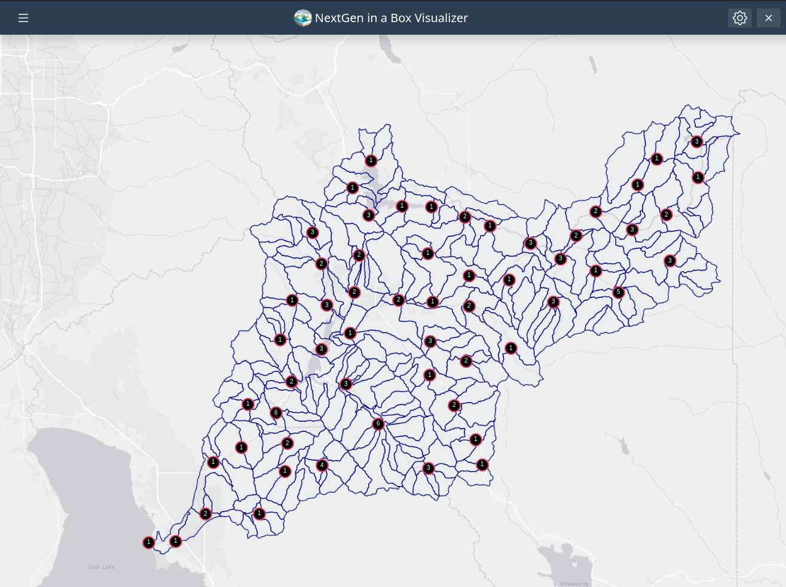
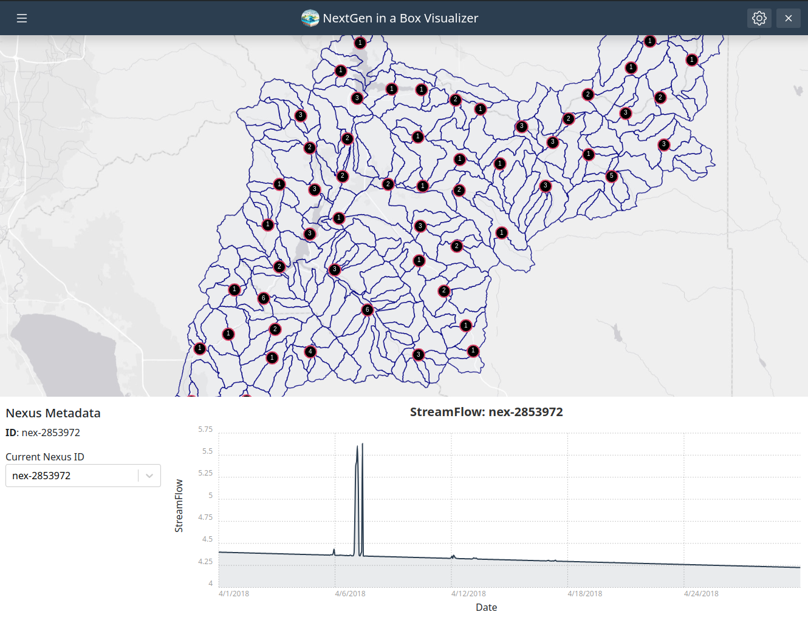

# NGIAB Data Visualizer

- Build using the [Tethys Platform](https://www.tethysplatform.org/).
- Geospatial and time series visualization of the Catchments and Nexus Points
- Outputs of different model runs can be visualized by the user mounting the outputs of the NextGen in a box in the `app_workspaces` of the application

  

# Visualization

- Catchments can be visualized by selecting catchments in the map, or using the custom dropdown to look for a specific catchment ID. In addition, variable time series can be visualized for each catchment using the variable dropdown menu.

- The Catchment layer is prepared into a `shapefile` and published to a local instance of GeoServer in order to allow catchment layers to be accessed using `WMS services`. The

  

- Nexus can be selected in the map. The different nexus points are clustered in order to allow Nexus layers containing thousands of nexus points. The nexus points can also be accessed using custom dropdown to look for a specific nexus ID

  

# Running the Application

## Running it through the [NGIABCloud](https://github.com/CIROH-UA/NGIAB-CloudInfra) Repository

It can be run through the `guide.sh`. Once it has has finished running, you will be be prompted to use NGIAB-Visualizer app for visualization. The application will mount the output of the model.
It can be run through the `viewOnTethys.sh`. It will prompt the user for the data folder they would like to use, and it will mount such directory top the app workspace:

Running it through the `guide.sh` or `viewOnTethys.sh` does the following:

- Start NGIAB client app and GeoServer containers
- Prepare the catchments by publishing a shapefile store, that can be accessed by WMS service
- Make a nexus.geojson (if none provided)
- Copy the nexus.geojson to the config folder
- Open a tab with the NGIAB client app in your current browser.

## Running it locally

### Requirements

- Docker
- miniconda3

### Steps

- Install the tethys platform, you can actually use the `micro-tethys` version.

```bash
conda create -n tethys -c tethysplatform -c conda-forge micro-tethys-platform
```

- Activate the tethys environment

```bash
conda activate tethys
```

- Generate the portal config file

```bash
tethys gen portal_config
```

- configure database. In this case sqlite

```bash
tethys db configure
```

- Install the application from source code by running the following command

```bash
tethys install -d
```

- Under the path `tethysapp/ngiab/workspaces/app_workspace` put the resource folder that you use to run `NGIAB`

- Spin an instance of GeoServer using the following command:

```bash
#this will pull the image, use default values, and when prompt to mount data directory, put a valid path
tethys docker init -c geoserver

#this will start the container
tethys docker start  -c geoserver
```

- Start the dev server

```bash
tethys manage start
```

- to access the app, you might use the following
  - user: admin
  - password: pass

### Additional resoruices Information

- [Getting Started with Tethys](https://docs.tethysplatform.org/en/stable/installation.html)
- [Source code](https://github.com/CIROH-UA/ngiab-client)
- [Docker Image](https://hub.docker.com/repository/docker/gioelkin/tethys-ngiab/general)
