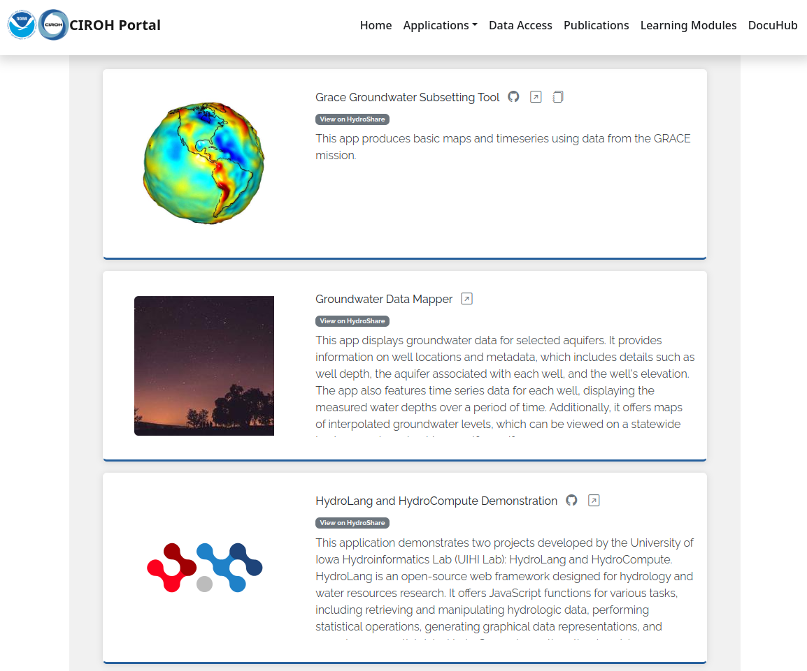
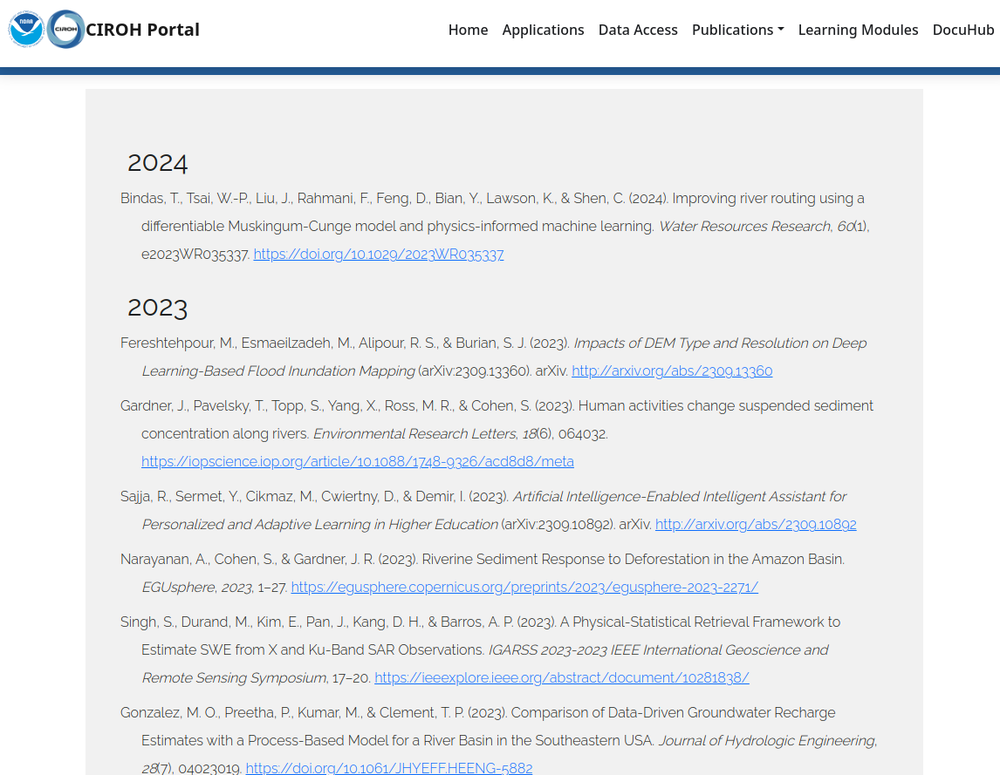

# CIROH Research Portal

Comprised of a large technologically and topically diverse group of scientists, CIROH and NOAA NWM researchers require a means to organize, catalog, coordinate, and share research data products, tools, visualizations, and interactive software applications in an accessible, consistent, and intuitive manner. This project aims to address this need by building and seeding a web-based catalog of interactive web applications, notebooks, software tools, and learning modules that demonstrate and provide access to NWM modeling advances, datasets, visualizations, and information synthesis innovations.

The resulting serves as a pathway for advances in research tools to inform the development of future applications within the National Water Center – e.g. within the Water Prediction Operations Division (WPOD) and the Geo Intelligence Division (GID). This project is a cross-cutting activity, exposing NWM research results across disciplines and institutions. The NWM Research Apps Portal is a highly visible resource that NOAA and CIROH leadership can use to showcase the work accomplished by the collaboration and within the cooperative institute. It also serve as a communication tool to allow the broader hydrologic research community to connect with the NWM research activities.

## Technologies

The proposed catalog is being built using Django CMS, Tethys Platform, HydroShare, HydroLearn, Amazon AWS cloud computing infrastructure, Google BigQuery data services, and an agile, continuous integration development and deployment approach. Use the following links to learn more about the technologies powering the NWM Research Apps Portal:

- [Django CMS](https://www.django-cms.org/) - A Content Management System built on the most popular open-source Python-based web framework: Django.
- [Tethys Platform](https://www.tethysplatform.org/) - An open-source web framework for build and hosting geospatial and scientific web applications.
- [HydroShare](https://www.hydroshare.org/) - CUAHSI's online collaboration environment for sharing data, models, and code.
- [HydroLearn](https://www.hydrolearn.org/) - A platform for instructors to find and collaborate on developing learning modules, and for students to discover and learn from authentic problems.
- [Amazon AWS](https://aws.amazon.com/) - The NWM Research Apps Portal is hosted on AWS cloud resources.
- [Google BigQuery](https://cloud.google.com/bigquery) - BigQuery is a serverless and cost-effective enterprise data warehouse that works across clouds and scales with your data. Use built-in ML/AI and BI for insights at scale.

## Research Applications

The portal includes applications developed using the [Tethys Platform framework](https://www.tethysplatform.org/), and external applications. Please use the following links to learn more about the applications hosted in the portal:

- [Water Data Explorer](https://github.com/BYU-Hydroinformatics/Water-Data-Explorer.git)
- [Met Data Explorer](https://github.com/BYU-Hydroinformatics/tethysapp-metdataexplorer.git)
- [HydroCompute &amp;&amp; HydroLang Tethys Application Demo](https://github.com/tethysplatform/tethysapp-hydrocompute.git)
- [SWE](https://github.com/Aquaveo/tethysapp-swe.git)
- [Ground Water Mapper Application](https://github.com/Aquaveo/gwdm.git) (GWDM)
- [Ground Subsseting Tool](https://github.com/Aquaveo/ggst.git) (GGST)
- [Snow Inspector](https://github.com/BYU-Hydroinformatics/snow-inspector)
- [OWP Tethys App](https://github.com/Aquaveo/OWP)
- [Community Streamflow Evaluation System (CSES)](https://github.com/whitelightning450/Tethys-CSES)
- [OWP NWM Map Viewer](https://water.noaa.gov/map) (Proxy App)
- [CIROH JupyterHub](https://jupyterhub.cuahsi.org/hub/login) (Proxy App)
- [HydroShare](https://www.hydroshare.org/home/) (Proxy App)

You can develop an application using the [Tethys platform](https://www.tethysplatform.org/), which can later be installed in the portal for greater visibility.

## Access

The developed NWM Research Apps Portal is hosted at https://portal.ciroh.org and serves as a platform that links and organizes together a curated selection of publicly-facing NWM visualization and analysis tools developed by CIROH and NOAA.

## Contribute

There are many ways to contribute to the NWM Research Apps Portal. You can contribute applications, datasets, learning modules, and publications, which will gain greater visibility within the CIROH community.

### Applications

If you would like any current application that you have to appear on the [portal application page](http://portal.ciroh.org/applications/), you can create a [HydroShare](https://www.hydroshare.org/home/) resource containing your application information, and it will be displayed automatically in the portal. Follow these steps:

1. Log in to HydroShare or create an account.
2. Create a HydroShare App Resource.
3. Add the following keyword: `nwm_portal_app`.
4. Fill in the following metadata:
   - `app_icon`
   - `help_page_url`
   - `app_home_page_url`
   - `source_code_url`
5. Make the resource public.

After following these steps, you will be able to see your app as shown below:

### Data

If you would like any current data set that you have to appear on the [portal data access page](http://portal.ciroh.org/data-access/), you can create a [HydroShare](https://www.hydroshare.org/home/) resource containing your dataset information, and it will be displayed automatically in the portal. Follow these steps:

1. Log in to HydroShare or create an account.
2. Create a HydroShare App Resource.
3. Add the following keyword: `nwm_portal_data`.
4. Fill in the following metadata:
   - `app_icon`
   - `help_page_url`
   - `app_home_page_url`
   - `source_code_url`
5. Make the resource public.

After following these steps, you will be able to see your dataset:

### Publications

If you would like any current or previous publication to appear on the [portal publications page](http://portal.ciroh.org/publications/), you can create a [Zotero](https://www.zotero.org/) item in the [Zotero CIROH Library Group](https://www.zotero.org/groups/5261687/ciroh/library) for your publications, and it will be displayed automatically in the portal. Follow these steps:

1. Request access to the [Zotero CIROH Library Group](https://www.zotero.org/groups/5261687/ciroh/library).
2. Return to your Zotero library.
3. Sync your Zotero account to see your group folder.
4. Click on a group folder, then add new citations using the Zotero icon in the URL bar or drag and drop items from other folders into your group folders.

After following these steps, you will be able to see your publications:

### Learning Modules

If you would like any [HydroLearn](https://www.hydrolearn.org/) learning module to appear on the [portal learning modules page](http://portal.ciroh.org/learning-modules/), you can create a HydroShare resource containing your learning module information, and it will be displayed automatically in the portal. Follow these steps:

1. Log in to HydroShare or create an account.
2. Create a HydroShare App Resource.
3. Add the following keyword: `nwm_portal_module`.
4. Make the resource public.

After following these steps, you will be able to see your learning module:

### Resources

- [Making Resources Public](https://help.hydroshare.org/sharing-and-privacy/sharing-and-publishing-resources/)
- [HydroShare Resources](https://help.hydroshare.org/hydroshare-resources/)
- [Uploading and Publishing Data and Models](https://help.hydroshare.org/creating-and-managing-resources/)

## Code

The source code for the NWM Research Apps Portal can be found on GitHub:

- [https://github.com/CIROH-UA/tethysportal-ciroh](https://github.com/CIROH-UA/tethysportal-ciroh)

## Bugs and Issues

Please report bugs and issues on the GitHub Issues page:

- [https://github.com/CIROH-UA/tethysportal-ciroh/issues](https://github.com/CIROH-UA/tethysportal-ciroh/issues)

## Team

- Brigham Young University - Roja Najafi, Iman Maghami, Dan Ames, Jim Nelson
- University of Iowa - Ibrahim Demir
- Aquaveo Contractors - Gio Romero, Michael Souffront, Nathan Swain
