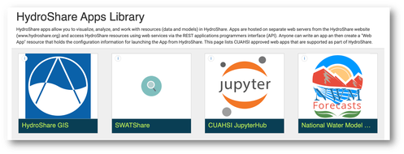
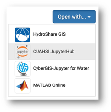

import Link from '@docusaurus/Link'

## An Introduction

The CUAHSI JupyterHub is a free cloud computing environment that enables researchers to execute scientific code and explore, modify, and interact with data inside a remote execution environment using Python and/or R programming languages. It is integrated with HydroShare and the Hydrologic Information System data repositories, making it easy to leverage community datasets, collaborate, and disseminate research workflows.

> **NOTE:** Below content is taken from [https://github.com/CUAHSI/jupyterhub/blob/main/docs/getting-started.md](https://github.com/CUAHSI/jupyterhub/blob/main/docs/getting-started.md)

# Getting Started
---

## Access

To access the CUAHSI JupyterHub platform, you must be a member of the CUAHSI JupyterHub Group. Group membership limits system interruptions and ensures that resources are effectively curated and managed. When first accessing the application, you will be directed to the CUAHSI JupyterHub Group landing page. Request to join the group, and after admission has been granted you will be able to access the computational environment. To expedite the approval process, please ensure that your HydroShare user profile is complete and up-to-date. Contact help@cuahsi.org if you have any questions regarding this process.

## Launching JupyterHub

There are multiple ways to access the CUAHSI JupyterHub platform which are listed below. All of these methods require that you register your HydroShare account with the CUAHSI JupyterHub Group (see :Access" above).

### HydroShare Web Application
The simplest way to get started with the CUAHSI JupyterHub is by launching it directly from the HydroShare Apps library ([hydroshare.org/apps](https://hydroshare.org/apps)) by clicking on the CUAHSI JupyterHub icon. This redirect you to the CUAHSI JupyterHub server where you will be asked to login using your HydroShare credentials. Once authenticated, you will be asked to choose a [Profile Environment](https://github.com/CUAHSI/jupyterhub/blob/main/docs/getting-started.md) which will be used to launch an isolated cloud computing environment for you to work in. 

In this space, you can create files and execute code from within your web browser. Any data you upload, download, and create is associated with your HydroShare account and will persist between sessions, meaning that it will be there next time you log in. Prior to gaining access, you will be asked join the CUAHSI JupyterHub HydroShare group (see the Access and Authentication section for details).

### HydroShare Open-With Menu
Another common way of accessing the CUAHSI JupyterHub environment is by using the HydroShare `Open with` functionality. This button can be found in the top right corner of any HydroShare resource landing page. After selecting "CUAHSI JupyterHub", a computing environment will be prepared and the content of the current HydroShare resource will be placed inside of it. This is a convenient method for executing code, data, and workflows that have been published in the HydroShare repository.

### Direct URL 

Once you are familiar with the this environment, it's often useful to access it directly rather than navigating through HydroShare. This can be done by simply navigating to [https://jupyterhub.cuahsi.org](https://jupyterhub.cuahsi.org).